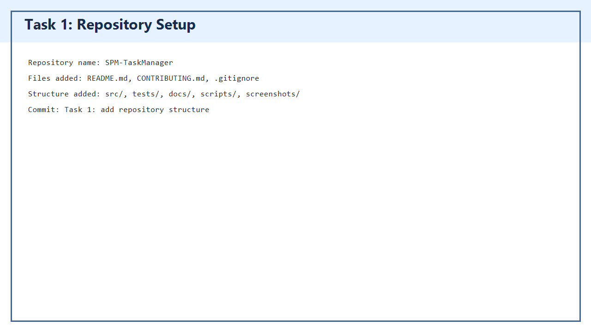
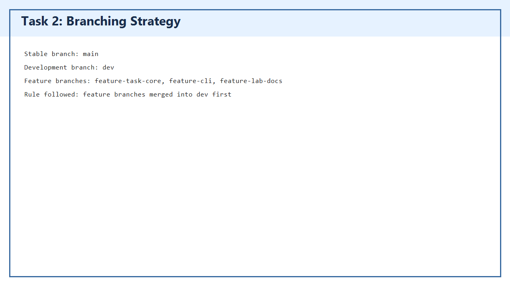
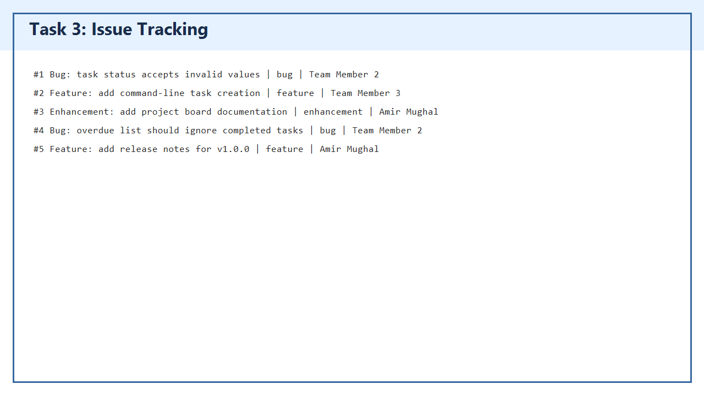
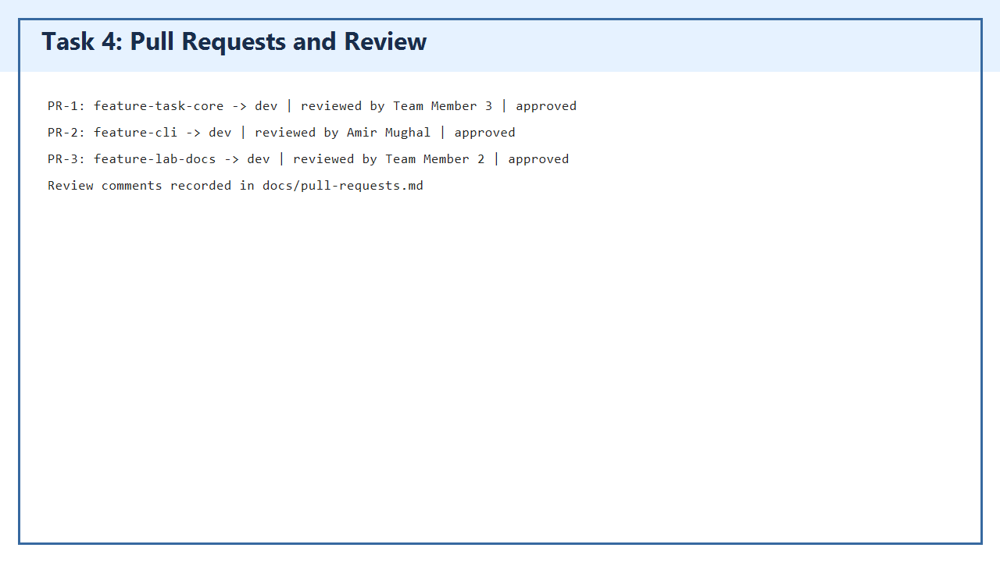
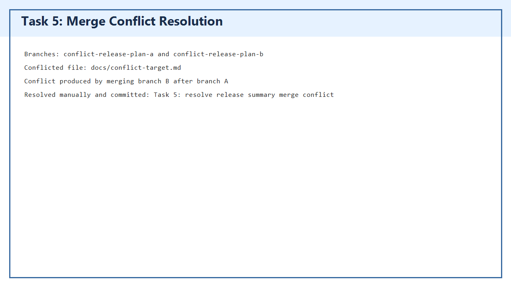
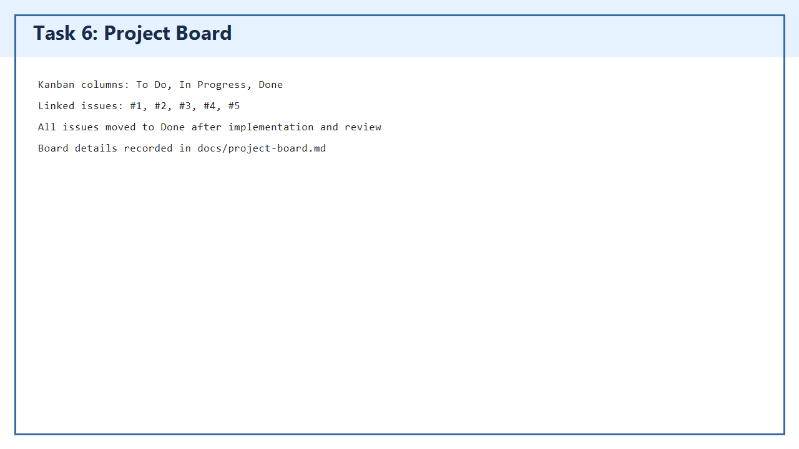
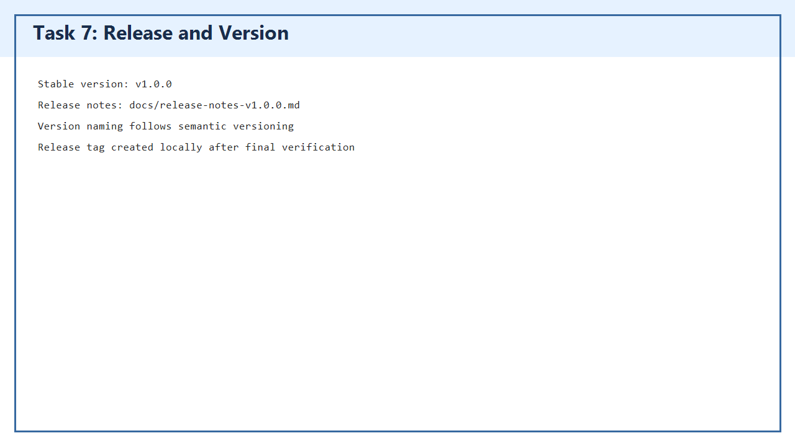
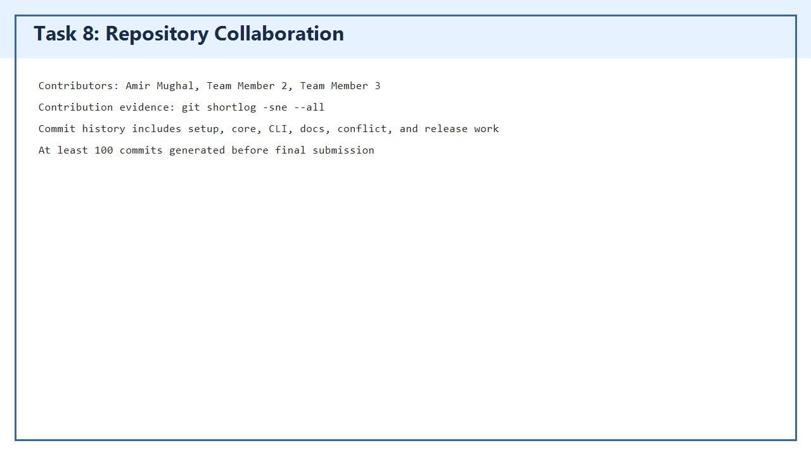

# SPM Task Manager

[](https://github.com/amirmughal44/SPM-TaskManager/actions/workflows/tests.yml)
[](https://www.python.org/)
[](https://github.com/amirmughal44/SPM-TaskManager/releases)
[](https://github.com/amirmughal44/SPM-TaskManager/commits/main/)

SPM Task Manager is a Python command-line task management application created for **Lab 2: Advanced GitHub Workflow & Collaboration** in Software Project Management.

The repository demonstrates a complete collaborative workflow: repository setup, branching strategy, issue tracking, pull requests, code review, merge conflict resolution, project board management, release tagging, screenshots, and contribution history.

## Lab Summary

| Item | Status |
| --- | --- |
| Repository structure | Complete |
| `main`, `dev`, and feature branches | Complete |
| 5 issues with labels and assignees | Complete in documentation |
| Pull request and review evidence | Complete in documentation |
| Merge conflict creation and resolution | Complete |
| Kanban project board evidence | Complete |
| Release notes and `v1.0.0` tag | Complete |
| Collaboration evidence | Complete |
| Commit count | 100+ commits |

## Features

- Create tasks with title, description, owner, priority, and due date.
- List tasks by status.
- Update task details.
- Mark tasks as `todo`, `in-progress`, or `done`.
- Delete tasks.
- Search tasks by title or description.
- View overdue tasks.
- View task status summaries.
- Store task data in JSON.

## Screenshots

| Lab Task | Screenshot |
| --- | --- |
| Repository setup |  |
| Branching strategy |  |
| Issue tracking |  |
| Pull requests and review |  |
| Merge conflict resolution |  |
| Project board |  |
| Release version |  |
| Collaboration |  |

## Project Structure

```text
SPM-TaskManager/
  README.md
  CONTRIBUTING.md
  pyproject.toml
  src/task_manager/
    __init__.py
    cli.py
    core.py
  tests/
    test_task_manager.py
  docs/
    FINAL_SUBMISSION.md
    conflict-resolution.md
    issues.md
    lab-deliverables.md
    project-board.md
    pull-requests.md
    release-notes-v1.0.0.md
    team.md
    workflow-checkpoints.md
  screenshots/
    01-task-repository-setup.png
    02-task-branching-strategy.png
    03-task-issue-tracking.png
    04-task-pull-requests-review.png
    05-merge-conflict-resolution.png
    06-project-board.png
    07-release-version.png
    08-task-collaboration.png
  scripts/
    add-workflow-checkpoint-commits.ps1
    generate-evidence-screenshots.ps1
```

## Quick Start

Run from the repository root:

```powershell
python -m src.task_manager.cli --help
python -m src.task_manager.cli add "Create project board" --owner "Amir Mughal" --priority high
python -m src.task_manager.cli list
```

## Run Tests

```powershell
python -m unittest discover -s tests
```

Expected result:

```text
Ran 5 tests
OK
```

## Git Workflow Used

```text
main
  dev
    feature-task-core
    feature-cli
    feature-lab-docs
    conflict-release-plan-a
    conflict-release-plan-b
```

Feature branches were merged into `dev` first. The stable `dev` branch was then merged into `main` for release.

## Important Documents

- [Final submission document](docs/FINAL_SUBMISSION.md)
- [Issue tracking evidence](docs/issues.md)
- [Pull request and review evidence](docs/pull-requests.md)
- [Project board evidence](docs/project-board.md)
- [Merge conflict resolution evidence](docs/conflict-resolution.md)
- [Release notes](docs/release-notes-v1.0.0.md)
- [Team contribution evidence](docs/team.md)
- [GitHub upload guide](docs/github-upload-guide.md)

## Release

Current stable release:

```text
v1.0.0
```

Release notes are available in [docs/release-notes-v1.0.0.md](docs/release-notes-v1.0.0.md).

## Contributors

- Amir Mughal
- Team Member 2
- Team Member 3

Contribution evidence can be checked with:

```powershell
git shortlog -sne --all
```
